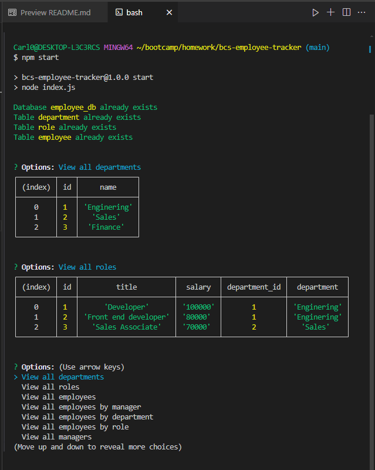

# Bcs-Employee-Tracker# My Project



<br>

## Description

This project is an Employee Management System designed to automate the management of employee data. The system uses a PostgreSQL database and a command-line interface built with Node.js and Inquirer.js.

Watch Demo 


## Table of Content
- [Features](#features)
- [Technologies](#technologies)
- [Getting Started](#getting-started)
- [Installation](#installation)
- [Usage](#usage)
- [Author](#author)
- [Contribution](#contribution)
- [Contribution Guidelines](#contribution-guidelines)
- [Questions](#questions)
- [License](#license)
 
<br>

## Features

- **Colorized Console Output:** Uses the colors library to provide colorized console outputs for better readability 
- **Database Management:** Functions to validate and create the database if it doesn't exist (validateDB).
- **Query Processing:** Handles the formatting and execution of SQL queries (formatingQuery, sendQuery, processQuery).
- **Dynamic Data Retrieval:** Retrieves choices dynamically for Inquirer prompts (getChoices).
- **Role and Department Management:** Allows adding, updating, and removing roles and departments.

<br>

## Technologies
Technologies used:
- **PostgreSQL**
- **Node.js**
- **Inquirer.js**

<br>

## Getting Started

### Prerequisites

Before you begin, ensure you have the following installed:

- [Node.js](https://nodejs.org/) (v14.0 or later)

- [Git](https://git-scm.com/)

- A text editor like [VSCode](https://code.visualstudio.com/)

<br>

## Installation
Follow these steps to get your development environment set up:
```bash
git clone https://github.com/febres0492/bcs-employee-tracker.git
cd bcs-employee-tracker
npm install
```

<br>

## Usage
Follow these steps:
```bash
npm start
```

<br>

## Author
**Carlos Febres**

<br>

## Contribution
Contributions are welcome

<br>

## Contribution Guidelines
Please get in contant for details on our code of conduct, and the process for submitting pull requests to us.

<br>

## Questions
For questions please get in contant.
Github Profile: https://github.com/febres0492   
Email: Febres0492@gmail.com

<br>

## License
[](https://opensource.org/licenses/MIT)

This project is licensed under the MIT License - see the [LICENSE](https://opensource.org/licenses/MIT) for details.
